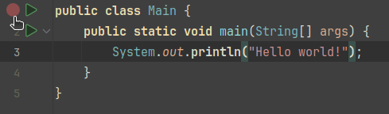
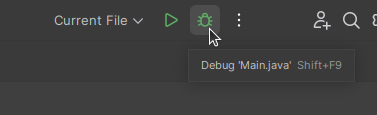
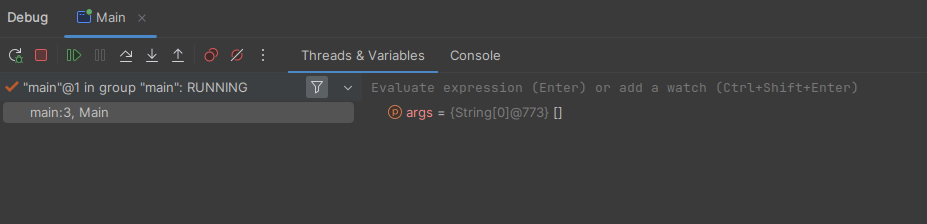

# Débogage et Correction du Code en Java

## Introduction

Le débogage est une compétence cruciale pour tout programmeur. Être capable de déboguer votre code de manière autonome vous permet d'identifier et de résoudre les problèmes efficacement sans dépendre des autres. Cette compétence améliore non seulement vos capacités de résolution de problèmes, mais aussi votre compréhension du fonctionnement de votre code. Dans ce guide, nous explorerons divers types d'erreurs, des stratégies pour diagnostiquer et corriger les problèmes, ainsi que les outils disponibles dans IntelliJ IDEA.

## Erreurs de Compilation

### Comprendre les Erreurs de Compilation

Les erreurs de compilation se produisent lorsque le compilateur Java rencontre des problèmes avec votre code qui l'empêchent de convertir votre code source en bytecode. Ces erreurs sont souvent liées à la syntaxe ou impliquent une utilisation incorrecte des fonctionnalités du langage.

#### Erreurs de Compilation Courantes

1. **Erreurs de Syntaxe** : Ces erreurs se produisent lorsque le code ne suit pas la syntaxe correcte. Par exemple :
    ```java
    public class Main {
        public static void main(String[] args) {
            System.out.println("Hello, World!")
        }
    }
    ```
    *Erreur* : Point-virgule manquant à la fin de l'instruction `println`.
    
    **Message du Compilateur** :
    ```
    Main.java:4: error: ';' expected
        System.out.println("Hello, World!")
                                        ^
    1 error
    ```

2. **Incompatibilité de Type** : Se produit lorsqu'il y a une tentative d'assigner ou d'utiliser une variable du mauvais type.
    ```java
    int number = "string";
    ```
    *Erreur* : Type incompatible.

    **Message du Compilateur** :
    ```
    Main.java:2: error: incompatible types: String cannot be converted to int
        int number = "string";
                       ^
    1 error
    ```

3. **Appel de Méthode Non-Statique depuis un Contexte Statique** : Se produit lorsqu'une méthode non-statique est appelée depuis un contexte statique.
    ```java
    public class Main {
        public void display() {
            System.out.println("Hello");
        }
        
        public static void main(String[] args) {
            display(); // Erreur ici
        }
    }
    ```
    *Erreur* : La méthode non-statique display() ne peut pas être référencée depuis un contexte statique.

    **Message du Compilateur** :
    ```
    Main.java:7: error: non-static method display() cannot be referenced from a static context
        display(); // Erreur ici
        ^
    1 error
    ```

Heureusement, les messages du compilateur sont généralement très descriptifs, alors **assurez-vous de les utiliser à votre avantage !**

## Erreurs d'Exécution

### Erreurs d'Exécution Courantes

Les erreurs d'exécution se produisent pendant que le programme est en cours d'exécution. Elles peuvent être plus difficiles à détecter car elles ne stoppent pas le processus de compilation mais causent un comportement inattendu du programme.

#### Exemples d'Erreurs d'Exécution

1. **Exception de Pointeur Null** : Se produit lorsque vous essayez d'utiliser une référence d'objet qui n'a pas été initialisée.
    ```java
    String str = null;
    System.out.println(str.length());
    ```
    *Erreur* : `NullPointerException`

2. **ArrayIndexOutOfBoundsException** : Se produit lorsque vous accédez à un tableau avec un indice invalide.
    ```java
    int[] arr = new int[5];
    System.out.println(arr[10]);
    ```
    *Erreur* : `ArrayIndexOutOfBoundsException`

3. **ArithmeticException** : Se produit lors d'opérations arithmétiques, comme une division par zéro.
    ```java
    int result = 10 / 0;
    ```
    *Erreur* : `ArithmeticException`

4. **ClassCastException** : Se produit lorsque vous essayez de convertir un objet en un type auquel il n'est pas une instance.
    ```java
    Object obj = "Hello";
    Integer num = (Integer) obj;
    ```
    *Erreur* : `ClassCastException`

### Identifier et Corriger les Erreurs d'Exécution

- **Utiliser les Pistes de Pile d'Exception** : La piste de pile fournit des informations sur l'endroit où l'erreur s'est produite. Par exemple :
    ```
    Exception in thread "main" java.lang.NullPointerException
        at Main.main(Main.java:4)
    ```
    *Utilisation* : La ligne `Main.java:4` indique que l'erreur s'est produite à la ligne 4 de `Main.java`. Vérifiez cette ligne pour des problèmes potentiels, tels que l'utilisation d'une variable non initialisée.

- **Vérifier les Valeurs d'Entrée** : Validez les entrées pour éviter les opérations invalides.
- **Ajouter des Déclarations de Débogage** : Les instructions de sortie peuvent aider à suivre le flux et les valeurs des variables.

Tout comme les messages du compilateur, les Pistes de Pile d'Exception sont très utiles pour vous permettre de diagnostiquer et de corriger votre code rapidement.

## Diagnostiquer et Corriger le Code Défectueux

### Stratégies pour Déboguer

1. **Utiliser les Outils de Débogage** : Définissez des points d'arrêt et parcourez votre code pour observer son exécution. 

   **Tutoriel de Débogage IntelliJ IDEA** :
   - **Définir des Points d'Arrêt** : Cliquez dans la marge gauche à côté des numéros de ligne dans l'éditeur pour définir des points d'arrêt.
     
     
     
   - **Commencer le Débogage** : Cliquez sur l'icône de Débogage (un insecte) dans le coin supérieur droit de l'IDE.

     

   - **Utiliser la Fenêtre d'Outils de Débogage** : Inspectez les variables, passez sur les lignes et évaluez les expressions en utilisant la fenêtre d'outils de débogage.
     
     
     

2. **Instructions de Sortie** : Ajoutez des instructions de sortie pour vérifier les valeurs des variables et le flux du programme.
    ```java
    System.out.println("Valeur de x : " + x);
    ```

3. **Expliquer le Code à Quelqu'un** : Expliquer votre code à quelqu'un d'autre peut vous aider à réaliser quel pourrait être l'erreur.

### Améliorer les Compétences en Recherche de Bugs

- **Développer une Approche Systématique** : Suivez une méthode étape par étape pour trouver les bugs, en commençant par reproduire le problème jusqu'à identifier la cause profonde.
- **Conserver une Liste de Vérification pour le Débogage** : Maintenez une liste de vérification des problèmes courants et des solutions pour rationaliser votre processus de débogage.

## Reproduire les Situations de Crash dans les Jeux

Lors de la programmation, vous pourriez avoir besoin de reproduire rapidement les situations de crash pour déboguer les problèmes - surtout si le problème prend un certain temps à se reproduire normalement (par exemple, devoir jouer tout le jeu lorsque le bug se produit à la fin).

### Techniques pour Reproduire les Crashes

1. **Créer des Cas de Test** : Écrivez des scénarios ou des cas de test spécifiques qui simulent les conditions menant au crash.
2. **Utiliser les Outils de Débogage** : Employez les fonctionnalités de débogage d'IntelliJ pour simuler différents états et interactions du jeu.
3. **Isoler le Code Problématique** : Identifiez et isolez les parties du code liées au crash et testez-les indépendamment.
4. **Codez les Variables** : Définissez les variables pertinentes pour accélérer le processus de reproduction du bug.

En suivant ces techniques, vous pouvez rapidement localiser et résoudre les crashes, rendant votre processus de débogage plus efficace.

## Conclusion

Être compétent en débogage et en correction de code est essentiel pour tout développeur. En comprenant les erreurs courantes, en utilisant des stratégies efficaces et en exploitant les outils disponibles dans IntelliJ IDEA, vous pouvez devenir un programmeur plus efficace et autonome. Pratiquez ces compétences régulièrement pour améliorer vos capacités de débogage et gérer les problèmes avec confiance.

## Note de Bas de Page

Il pourrait y avoir des omissions ou des erreurs, n'hésitez pas à me contacter à l'adresse mehdi.alaoui@epfl.ch si des corrections ou des ajouts pertinents doivent être faits :-)